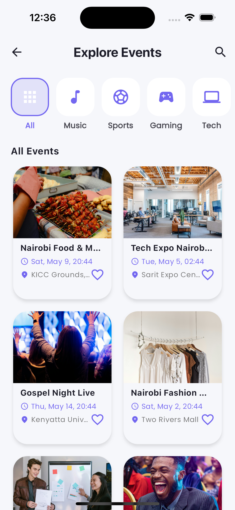
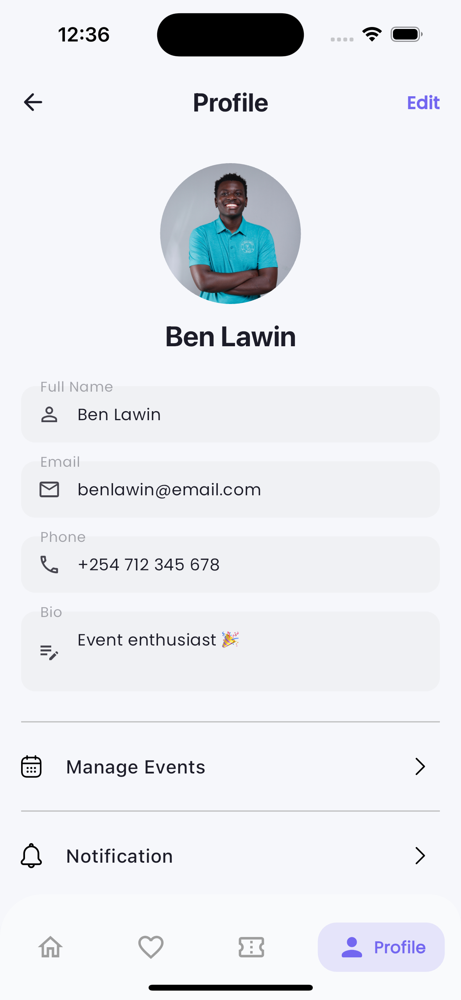
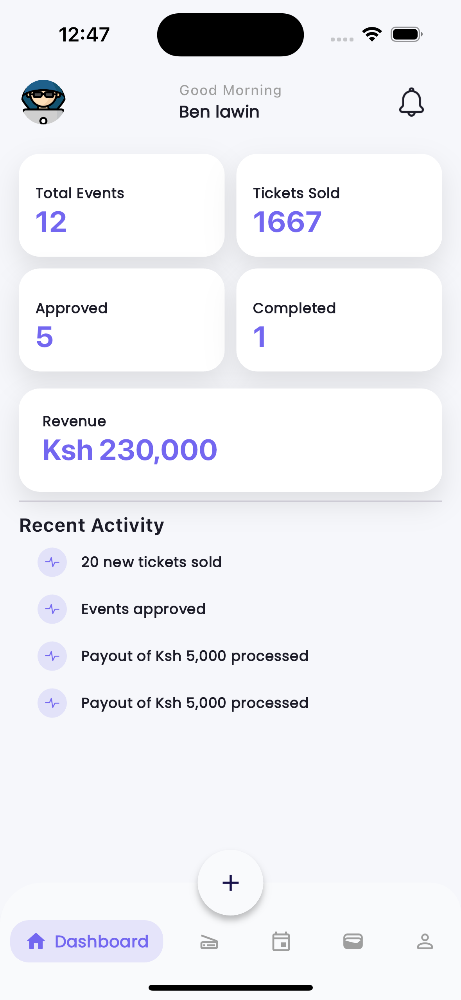
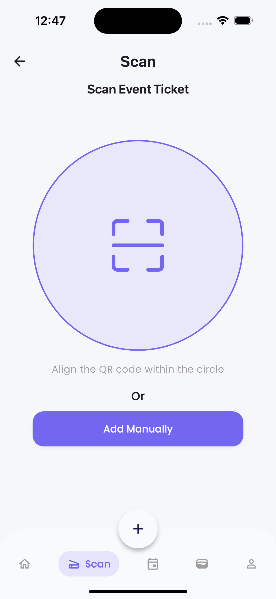
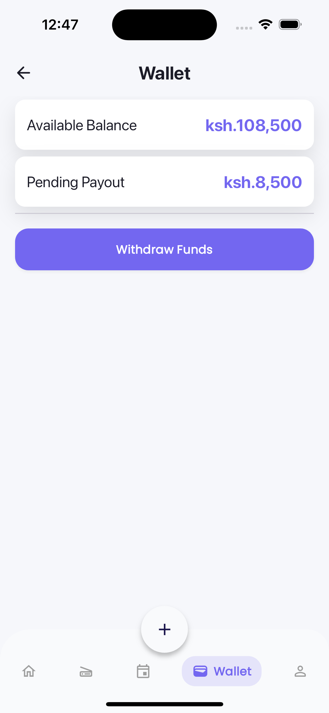

# Eventie 

> A two-sided mobile app for discovering and booking events (attendees) and creating and managing them (organizers) — built with Flutter.

---

## 📸 Screenshots

**Attendee**

| Explore Events | Favourites | Profile |
|:-:|:-:|:-:|
|  |  |  |

**Organizer**

| Dashboard | Ticket Scanner | Wallet |
|:-:|:-:|:-:|
|  |  |  |

---

## ✨ Features

**For Attendees**
- 🔍 Browse events by category — Music, Sports, Gaming, Tech, and more
- ❤️ Save favourite events for quick access
- 🎟️ Book tickets with QR-code e-ticket generation
- 📅 Track bookings — Active, Completed, and Cancelled

**For Organizers**
- ➕ Create and publish events
- 📊 Dashboard with live stats — total events, tickets sold, revenue (Ksh)
- 📷 Scan attendee QR tickets at the door (or add manually)
- 💰 Wallet with available balance, pending payouts, and withdrawals

---

## 🛠️ Tech Stack

| Layer | Technology |
|---|---|
| Framework | Flutter (Dart) |
| State Management | Riverpod |
| Architecture | Feature-based modular structure |

---

## 📂 Project Structure

```
lib/
├── customer/
│   ├── screens/        # All app screens (home, booking, profile, etc.)
│   ├── providers/      # Riverpod state providers
│   └── widgets/        # Screen-specific reusable widgets
├── data/
│   ├── models/         # Data models (Event, Booking, User, etc.)
│   └── dummy_data.dart # Local mock data
├── widgets/            # Shared/global widgets
└── main.dart
```

---

## ⚙️ Getting Started

### Prerequisites

- [Flutter SDK](https://docs.flutter.dev/get-started/install) (3.x or later)
- Android Studio or VS Code with the Flutter extension
- An emulator or physical device (iOS or Android)

### Installation

```bash
# Clone the repository
git clone https://github.com/ben-lawino/eventie.git
cd eventie

# Install dependencies
flutter pub get

# Run the app
flutter run
```

---

## 💡 Key Highlights

- **Riverpod** for scalable state management across both attendee and organizer flows
- **Dual-role architecture** — clean separation between attendee and organizer screens
- **QR scanning + generation** — attendees get QR e-tickets; organizers scan them at the door
- **Organizer wallet** — tracks revenue, available balance, and pending payouts in Ksh

---

## 🔮 Roadmap

These features are actively being worked on:

- [ ] 🔐 **Authentication** — Firebase Auth (email/Google sign-in)
- [ ] 💳 **Mpesa Integration** — Native mobile payments for Kenyan users
- [ ] 🌍 **Backend / REST API** — Move from dummy data to a live backend
- [ ] 📡 **Real-time Updates** — Live booking and availability status
- [ ] 🧠 **AI Recommendations** — Personalised event suggestions

---

## 🤝 Contributing

Contributions are welcome! Here's how to get started:

```bash
# Fork the repo, then:
git checkout -b feature/your-feature-name
git commit -m "feat: add your feature"
git push origin feature/your-feature-name
# Open a Pull Request
```

Please keep PRs focused and include a brief description of what changed and why.

---

## 👤 Author

**Benjamin Lawino**  
Flutter Developer

[](https://github.com/ben-lawino)
[](https://www.linkedin.com/in/benjamin-lawino/)

---

## ⭐ Support

If you find this project useful or impressive, please give it a star ⭐ — it helps others discover it!